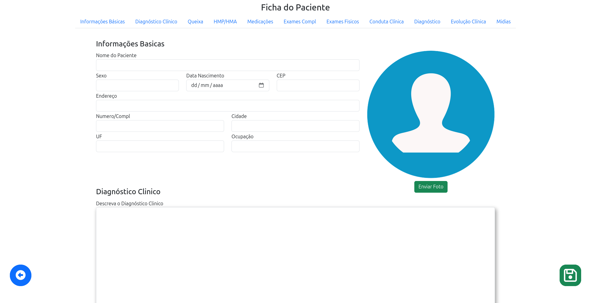
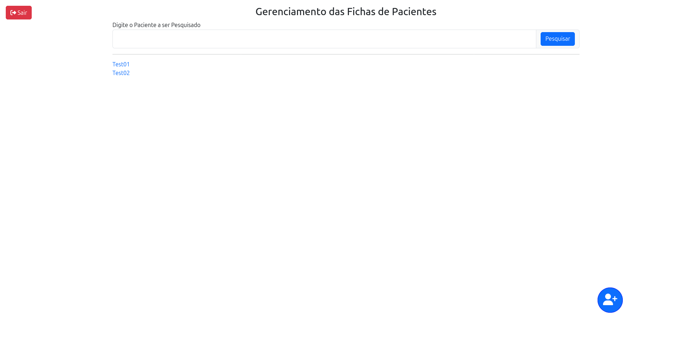

# 🏥 Clínica Salutar

Sistema web completo para gestão de fichas de pacientes em clínicas de fisioterapia, com módulos de registro de dados, upload de mídias e autenticação segura.

A complete web system for managing patient records in physical therapy clinics, featuring data registration, media uploads, and secure authentication.

---

<details>
<summary>🇧🇷 Versão em Português</summary>

## 📋 Sobre o Projeto

A Clínica Salutar é um sistema de gestão de pacientes desenvolvido para clínicas de fisioterapia. Ele permite o registro detalhado de fichas de pacientes, acompanhamento clínico com histórico e upload de fotos/vídeos para documentação.

## 🚀 Tecnologias Utilizadas

Este projeto é uma aplicação full-stack composta por um backend, um frontend e um banco de dados, orquestrados com Docker Compose:

* **Backend:** Java 17 com Spring Boot (v3.5.0)
    * Spring Security (Autenticação JWT, BCrypt para senhas)
    * Spring Data JPA (Persistência de dados)
    * JJWT (JSON Web Token)
* **Frontend:** Angular (v17.x.x)
    * Bootstrap 5 (Layout e componentes)
    * Font Awesome (Ícones)
* **Banco de Dados:** MySQL 8
* **Containerização:** Docker e Docker Compose
* **Servidor Web (Frontend):** Nginx (servindo a aplicação Angular compilada)

## 🔑 Funcionalidades Principais

* **Login de Usuário:** Sistema de autenticação seguro com geração de token JWT.
    * **Usuário Padrão (Admin):** `admin`
    * **Senha Padrão:** `1234`
* **Gestão de Fichas de Pacientes:**
    * Cadastro completo de informações básicas (nome, data de nascimento, endereço, etc.).
    * Registro de histórico clínico detalhado (diagnóstico clínico, queixa principal, medicações, exames, etc.).
* **Preenchimento Automático de Endereço:** Conexão com a API do ViaCEP para preencher automaticamente informações de endereço (logradouro, cidade, estado) a partir do CEP.
* **Upload e Gestão de Mídias:**
    * Upload de fotos e vídeos associados à ficha do paciente.
    * Visualização de mídias anexadas.
    * (Configurado para salvar as mídias em um volume Docker persistente).

## 💡 Como Rodar o Projeto

Este projeto utiliza Docker Compose para simplificar a configuração do ambiente. Certifique-se de ter o [Docker Desktop](https://www.docker.com/products/docker-desktop/) (ou Docker Engine e Docker Compose no Linux) instalado e em execução.

1.  **Clone o Repositório:**
    ```bash
    git clone [https://github.com/ViniciusTeixeira-Dev/Clinica-Salutar.git](https://github.com/ViniciusTeixeira-Dev/Clinica-Salutar.git)
    cd Clinica-Salutar
    ```

2.  **Inicie os Contêineres (Build e Execução):**
    Na pasta raiz do projeto (`Clinica-Salutar`), execute os seguintes comandos:
    * **Pare e remova qualquer instância anterior e volumes de dados (isso garantirá um banco de dados limpo e o script SQL será executado):**
        ```bash
        docker compose down -v
        ```
    * **Construa as imagens do Docker (backend e frontend). Use `--no-cache` para garantir um build limpo na primeira vez ou após mudanças importantes:**
        ```bash
        docker compose build --no-cache
        ```
    * **Inicie todos os serviços em segundo plano:**
        ```bash
        docker compose up -d
        ```

3.  **Acesse a Aplicação:**
    * Abra seu navegador e acesse: `http://localhost:4200`
    * Faça login com:
        * **Usuário:** `admin`
        * **Senha:** `1234`


## 🛣️ Estrutura de Rotas (Exemplos da API Backend)

| Método | Endpoint                    | Descrição                                                                      |
|--------|-----------------------------|--------------------------------------------------------------------------------|
| POST   | `/`                         | Autentica o usuário e retorna um token JWT.                                    |
| GET    | `/main`                     | Rota principal para visualização e navegação das fichas de pacientes.          |
| POST   | `/fichas/NOVA`              | Cadastra uma nova ficha de paciente.                                           |
| PUT    | `/fichas/{id}`              | Atualiza uma ficha de paciente existente pelo ID.                              |
| GET    | `/fichas/{id}`              | Busca uma ficha de paciente pelo ID.                                           |


</details>

---

<details>
<summary>🇺🇸 English Version</summary>

## 📋 About the Project

Clinica Salutar is a patient management system developed for physical therapy clinics. It allows for detailed patient record keeping, clinical tracking with history, and photo/video uploads for documentation.

## 🚀 Technologies Used

This project is a full-stack application composed of a backend, a frontend, and a database, orchestrated with Docker Compose:

* **Backend:** Java 17 with Spring Boot (v3.5.0)
    * Spring Security (JWT Authentication, BCrypt for passwords)
    * Spring Data JPA (Data Persistence)
    * JJWT (JSON Web Token)
* **Frontend:** Angular (v17.x.x)
    * Bootstrap 5 (Layout and components)
    * Font Awesome (Icons)
* **Database:** MySQL 8
* **Containerization:** Docker and Docker Compose
* **Web Server (Frontend):** Nginx (serving the compiled Angular application)

## 🔑 Key Features

* **User Login:** Secure authentication system with JWT token generation.
    * **Default Admin User:** `admin`
    * **Default Password:** `1234`
* **Patient Record Management:**
    * Comprehensive registration of basic information (name, date of birth, address, etc.).
    * Detailed clinical history recording (clinical diagnosis, main complaint, medications, exams, etc.).
* **Automatic Address Filling:** Connection with the ViaCEP API to automatically fill in address information (street, city, state) based on the CEP (ZIP code).
* **Media Upload and Management:**
    * Upload photos and videos associated with the patient's record.
    * Viewing of attached media.
    * (Configured to save media to a persistent Docker volume).

## 💡 How to Run the Project

This project uses Docker Compose to simplify environment setup. Ensure you have [Docker Desktop](https://www.docker.com/products/docker-desktop/) (or Docker Engine and Docker Compose on Linux) installed and running.

1.  **Clone the Repository:**
    ```bash
    git clone [https://github.com/ViniciusTeixeira-Dev/Clinica-Salutar.git](https://github.com/ViniciusTeixeira-Dev/Clinica-Salutar.git)
    cd Clinica-Salutar
    ```

2.  **Start the Containers (Build and Run):**
    In the project root directory (`Clinica-Salutar`), execute the following commands:
    * **Stop and remove any previous instances and data volumes (this ensures a clean database and the SQL script will run):**
        ```bash
        docker compose down -v
        ```
    * **Build the Docker images (backend and frontend). Use `--no-cache` to ensure a clean build the first time or after significant changes:**
        ```bash
        docker compose build --no-cache
        ```
    * **Start all services in detached mode:**
        ```bash
        docker compose up -d
        ```

3.  **Access the Application:**
    * Open your browser and navigate to: `http://localhost:4200`
    * Log in with:
        * **Username:** `admin`
        * **Password:** `1234`

4.  **Test Uploads:**
    * After logging in, test uploading images/media. They should be saved and displayed correctly.

## 🛣️ API Routes (Backend Examples)

| Method | Endpoint                    | Description                                                            |
|--------|-----------------------------|------------------------------------------------------------------------|
| POST   | `/login`                    | Authenticates the user and returns a JWT token.                        |
| GET    | `/main`                     | Main route for viewing and navigating patient records.                 |
| POST   | `/fichas/NOVA`              | Registers a new patient record.                                        |
| PUT    | `/fichas/{id}`              | Updates an existing patient record by ID.                              |
| GET    | `/fichas/{id}`              | Retrieves a patient record by ID.                                      |

</details>

## 🖼️ Screenshots

### Patient Record


### Record Management

